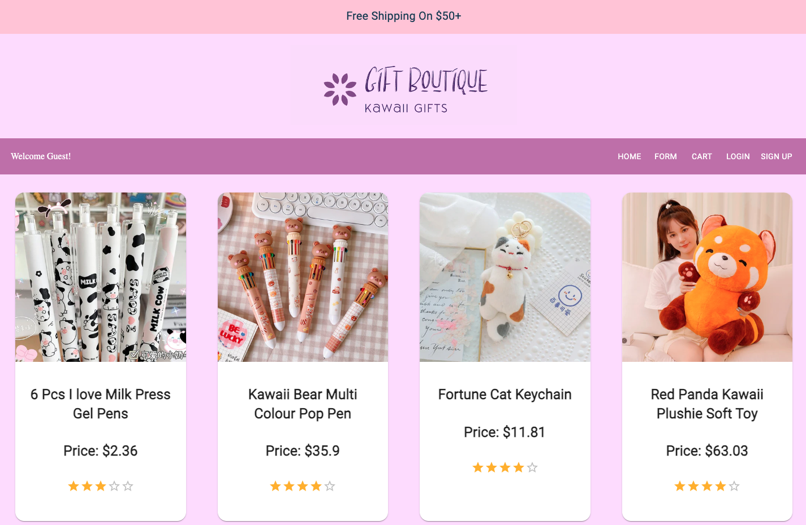

# Gift Boutique 
## About The Project
Online marketplace that delivers a user-friendly interface for customers to explore and purchase unique gifts

 

### Link to website: 
http://giftboutique.wendyprojects.com

Deployed on AWS EC2 and used Docker for containerization<br>
To see Docker setup, go to branch feature/dockeritup 


<p align="right">(<a href="#readme-top">back to top</a>)</p>

## Built With
* React 
* Material UI 
* Ruby on Rails 
* Material UI 
* Postgres 
* Firebase 
* Docker 


<p align="right">(<a href="#readme-top">back to top</a>)</p>


## Getting Started

Clone the repo
   ```sh
   git clone https://github.com/wendy174/gift_boutique.git
   ```
### Front End Setup 

Cd into client, install the dependencies, and run the server. 

```console
$ cd client 
$ npm install 
$ npm start
```

### Back End Setup 

Install the dependencies, create a database, migrate, seed your file, then start the server 

```console
$ bundle install 
$ rails db:create 
$ rails db:migrate 
$ rails db:seed
$ rails server
```


### To see all features of this application please create an account  


## Authors 

* Wendy Yeung: https://github.com/wendy174


## Contributing

Contributions are what make the open source community such an amazing place to learn, inspire, and create. Any contributions you make are **greatly appreciated**.

If you have a suggestion that would make this better, please fork the repo and create a pull request. You can also simply open an issue with the tag "enhancement".
Don't forget to give the project a star! Thanks again!

1. Fork the Project
2. Create your Feature Branch (`git checkout -b feature/AmazingFeature`)
3. Commit your Changes (`git commit -m 'Add some AmazingFeature'`)
4. Push to the Branch (`git push origin feature/AmazingFeature`)
5. Open a Pull Request

<p align="right">(<a href="#readme-top">back to top</a>)</p>

## Notes
### Two docker-compose files: 
docker-compose.dev.yml for development 
docker-compose.yml for production 

To run docker for development: 
```console
$ docker-compose -f docker-compose-dev.yml up --build
```


